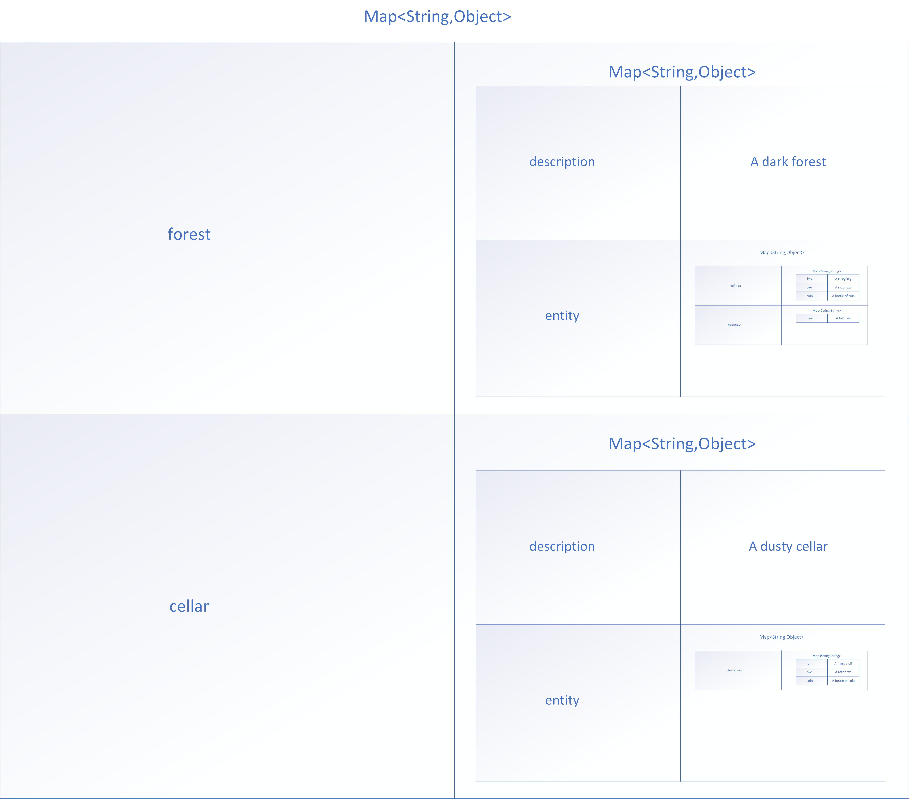
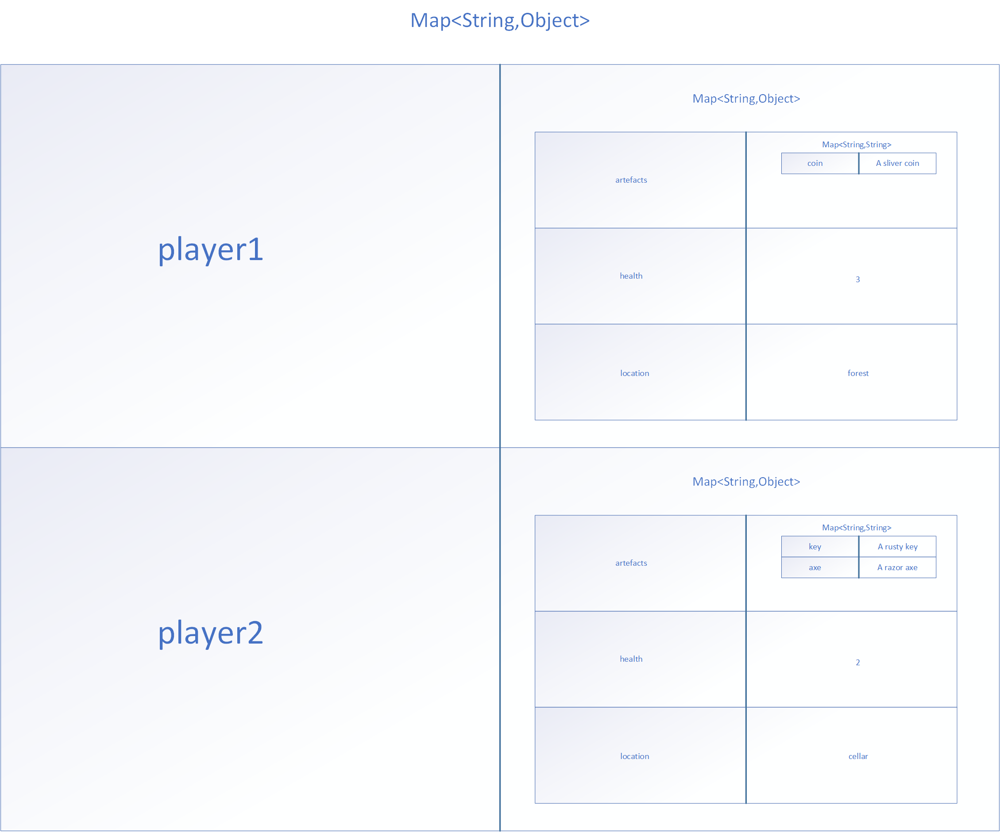

# 实现一个Java游戏服务器

- 要求实现一个Java开发的文字游戏服务器 支持不同的玩家进入游戏 我们有多块游戏地图以及分布于地图中的众多道具 地图之间存在着单向的或者双向的道路连接 我们可以将拾取的道具放置在背包中 也可以从背包中丢弃状态 我们可以看到处于同一个地图中的游戏玩家列表 我们有自己的血条 可以使用道具对地图中的精灵做一些事情......同时我们自己也会受到伤害................ 

- 演示视频
```html
<video id="video" controls="" preload="none" poster="封面">
      <source id="mp4" src="./03.完整程序/01.idea运行(idea工程文件)/idea中运行-演示视频.mp4" type="video/mp4">
</videos>
```

- 地图数据存储方案


- 用户数据存储方案


- 扩展动作解析思路

```

将输入命令按照空格解析为命令数组

if(如果命令数组包含作用对象的全部){

	该条命令成立 可以继续执行
	
	if(作用的对象存在于当前地图){
		
		if(作用的对象不在当前地点){
		
			return
			
		}
		
	}
	
	if(消耗的对象为空){
	
		什么都不做
	
	}
	else if(消耗的对象为道具){
	
		if(玩家有){
		
			从玩家背包中寻找该道具并删除
			
		}else{
		
			return
			
		}
		
		
	}else if(消耗的对象为家具){
	
		if(当前地点有){
		
			从当前环境中寻找家具并删除
			
		}else{
		
			return
			
		}
		
	}else if(消耗的对象为健康值关键字){
	
		将健康值-1
		
	}
	
	if(产生的对象为空){
		
		什么都不做
		
	}else if(产生的对象为健康值关键字){
	
		玩家健康值+1
	
	}else if(产生的对象为地图关键字){
	
		将当前地点和该地图关键字设置为双向路线
	
	}else{
	
		将产生的对象放在地图中
	
	}

}

```
